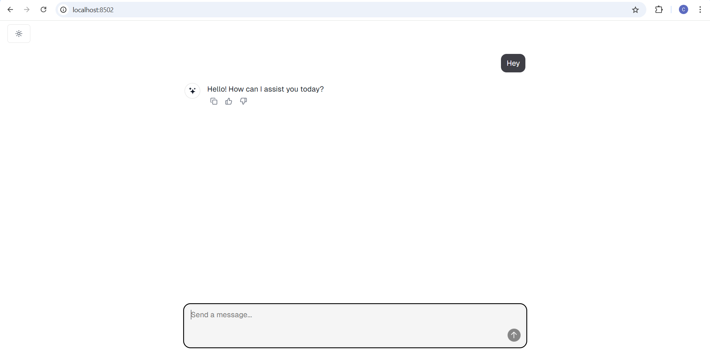

# Chat Flow

A lightweight and modern chat interface for LLM interactions with Markdown support!

👉 Looking for a version with web search integration?   
Check out the [`websearch_template`](https://github.com/vishnuvardhan4335/Chat-Flow) branch, which includes contributions from [Vishnu Vardhan](https://github.com/vishnuvardhan4335)

WebSocket connection refactured by [Chandrika](https://github.com/chandrikatadiboyina)

## Overview

A minimalist chat interface built with React and TypeScript, designed to be easily integrated with any LLM backend. Features a clean and modern design.



## Getting Started

1. Clone the repository
```bash
git clonehttps://github.com/vishnuvardhan4335/Chat-Flow
cd Chat-Flow
```

2. Install dependencies
```bash
npm i
```

3. Start the development server
```bash
npm run dev
```

## Test Mode

The project includes a test backend for development and testing purposes. To use the test mode:

1. Navigate to the testbackend directory
2. Create a Python virtual environment:
```bash
python -m venv venv
source venv/bin/activate  # On Windows use: venv\Scripts\activate
```
3. Install the required package:
```bash
pip install websockets
```
4. Run the test backend:
```bash
python test.py
```

## Credits

This project was built by:
- [Chandrika](https://github.com/chandrikatadiboyina)
- [Vishnu Vardhan](https://github.com/vishnuvardhan4335)

Additional contribution by:
- [Vishnu Vardhan](https://github.com/vishnuvardhan4335) – Implemented web search and integrated it into the LLM prompt

Some code components were inspired by and adapted from [Vercel's AI Chatbot](https://github.com/vercel/ai-chatbot).

